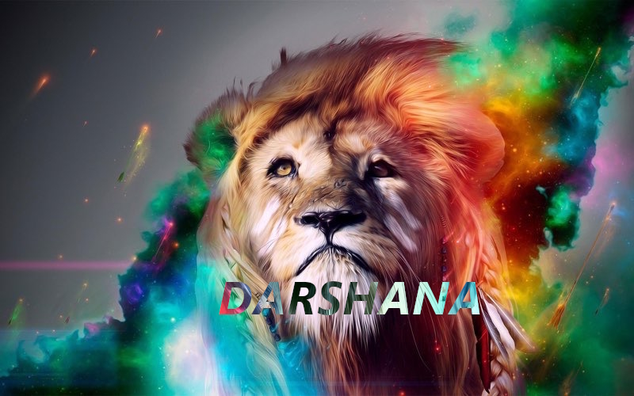

<div align="center">
  
  <p align="center">
<a href="#"></a>
</p>
  <p align="center">
<a href="https://github.com/Ajay-o-s"></a>

</p>
</div>
<p align="center">
Project created by <a href="https://github.com/Ajay-o-s">AJAY O S</a> to make it public <br> | © | Reserved |<br> 
</p>

----

<div align="center">

# ***SETUP***

  
  ## MESSAGE TO KERTHANA

<br>
  <a href="https://github.com/Ajay-o-s"></a><br>

## DEPLOY
  [](https://heroku.com/deploy?template=https://github.com/Ajay-o-s/Darshana)<br>
  ## QR
[](https://replit.com/@Kerthana/Darshana)
<br>

---

  <div align="center">
       
  [](https://github.com/Ajay-o-s/Darshana)
  </div>
    
---


### ⚠️ Warning! 
```
Due to Userbot; Your WhatsApp account may be banned.
This is an open source project, 
you are responsible for everything you do.  Absolutely, 
you are deemed to have accepted these responsibilities.

```

## Developer


<div align="center">
    
  [](https://github.com/Ajay-o-s)

#  [AJAY O S](https://github.com/Ajay-o-s)
  </div>
    


## License
This project is protected by `MIT` license.

### Disclaimer
`WhatsApp` name, its variations and the logo are registered trademarks of Facebook. We have nothing to do with the registered trademark
